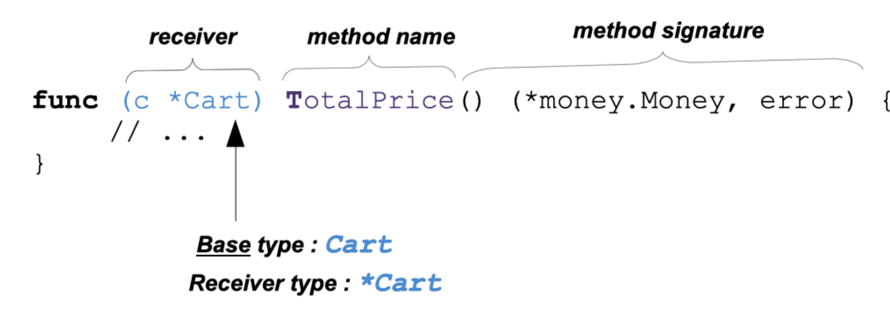

# Methods are capabilities

With methods, you can give additional capabilities to the cart Type.

- A method is a function with a receiver.1.

- The receiver of a method is a special parameter.

- The receiver is not listed in the parameter list but before the method name

- A method can have only one receiver.

## pointer receiver vs value receiver